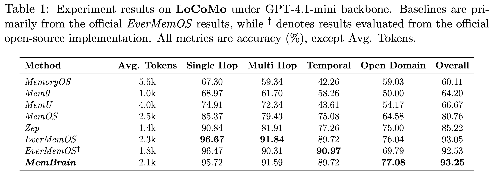
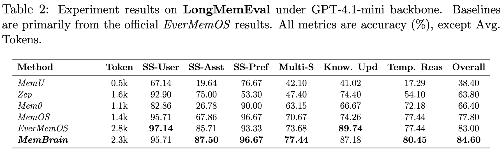
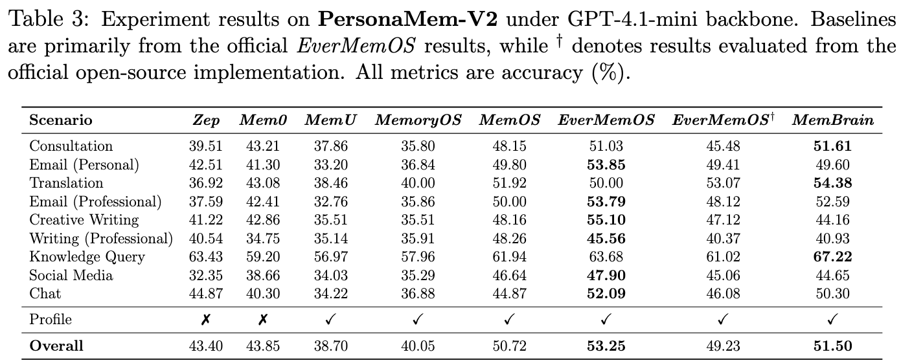
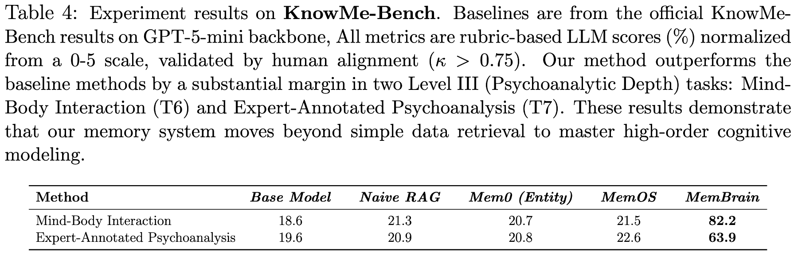

# MemBrain 1.0

Welcome to **MemBrain** – a long-term memory and context management solution for agentic AI systems.

MemBrain enables AI agents to efficiently store, retrieve, and reason over long-term experiences, delivering truly context-aware and personalized interactions.

## Evaluation Results

🏆 **Achieved SOTA performance** on multiple benchmarks.

## Technical Highlights

### Agentic Memory Architecture

Contemporary agent memory systems employ hybrid retrieval architectures that combine multiple indexing strategies—including lexical matching (BM25), dense vector embeddings, and knowledge graph traversal—to achieve robust memory retrieval across diverse query types. However, these systems face a fundamental limitation: **static execution with predetermined parameters**. Retrieval strategies are fixed at design time, unable to adapt to query complexity or context dynamically. While recent advances such as EverMemOS have introduced query rewriting mechanisms to handle multi-dimensional queries, these approaches remain **inherently reactive**—operating through single-round triggering patterns that cannot iteratively refine retrieval strategies based on intermediate results.

This constraint becomes critical when dealing with:

- Complex queries requiring multi-hop reasoning
- Scenarios where initial retrieval yields incomplete or ambiguous results
- Dynamic contexts where optimal retrieval strategies vary by query type

**MemBrain's Solution:** We address this limitation through an **agent-based memory orchestration framework** that transforms static retrieval into dynamic, collaborative intelligence. Rather than hardcoding retrieval pipelines, we decompose memory operations into specialized, autonomous sub-agents that coordinate adaptively based on query complexity and intermediate results.

#### Core Architecture

MemBrain reconstructs the memory system as a **multi-agent collaborative network** where:

- **Specialized agents** handle domain-specific operations: entity extraction, conversation summarization, memory consolidation, conflict resolution, and hierarchical compression
- **Traditional retrieval methods** are exposed as callable tools within the agent ecosystem
- **Adaptive orchestration** shifts decision-making from predetermined flows to runtime inter-agent coordination based on task requirements and contextual signals

#### Key Advantages

| Capability         | Description                                                                                         |
| ------------------ | --------------------------------------------------------------------------------------------------- |
| **Modularity**     | Independent agents enable isolated development, testing, and deployment of memory operations        |
| **Extensibility**  | New memory operations integrate seamlessly as additional agents without architectural modifications |
| **Adaptability**   | Runtime coordination allows context-aware retrieval strategy selection and multi-round refinement   |
| **Asynchronicity** | Agent-based design naturally supports non-blocking memory updates and concurrent operations         |

This architecture enables MemBrain to dynamically compose retrieval strategies—for instance, triggering query rewriting when initial results are sparse or invoking memory consolidation agents when detecting temporal inconsistencies.

### 2. Entity and Temporal Context Management

Accurate extraction and organization of entities and temporal information from conversational history is fundamental to advanced memory capabilities such as correlation analysis and temporal reasoning. However, current approaches face systematic limitations:

- **Incomplete entity-temporal capture**: Missing or underspecified temporal metadata and ambiguous relationship encoding prevent reliable correlation analysis
- **Inconsistent temporal standardization**: Variable time expression formats and event representation across conversations hinder cross-session reasoning
- **Context loss in summarization**: Fine-grained semantic details are lost when compressing conversational history for long-term storage

**MemBrain's Contribution:** We implement systematic structural optimizations for long-term context management through:

- **Refined schema design** ensuring complete entity extraction with normalized temporal metadata
- **Context alignment mechanisms** maintaining high-fidelity semantic relationships
- **Structured data organization** enabling efficient temporal querying and correlation analysis

These improvements establish a foundation for reliable downstream reasoning over extended conversational contexts.

### 3. Compositional Memory Organization

Graph-based memory structures are intuitive for representing complex entity relationships. However, an architectural mismatch exists: contemporary foundation models are optimized for processing sequential or hierarchical information structures rather than arbitrary graph topologies. This incompatibility has practical implications—in existing graph-database memory systems, traditional graph algorithms perform the primary reasoning, while LLMs operate on flattened or serialized representations. This separation introduces semantic information loss during structure-to-text transformations, limiting LLMs' reasoning capabilities over memory.

**MemBrain's Contribution:** We adopt a representation strategy aligned with LLM architectural strengths. Rather than imposing graph structures, we organize related information into composable semantic units that can be loaded on-demand into context. Inspired by file-based organization principles, this approach:

- Preserves inter-entity relationships through structured semantic packaging
- Enables direct LLM reasoning over memory content without lossy transformations
- Supports flexible, query-driven information assembly
- Allows LLMs to participate deeply in memory reasoning rather than operating on pre-processed graph outputs

This design leverages LLMs' native capabilities for contextual understanding while maintaining the relational expressiveness required for complex memory operations.

## 🚀 Open Source Roadmap

We're committed to making MemBrain accessible to the community. Coming soon:

- [ ] Core source code
- [ ] Evaluation and benchmarking tools
- [ ] Local deployment API with documentation

Stay tuned!
